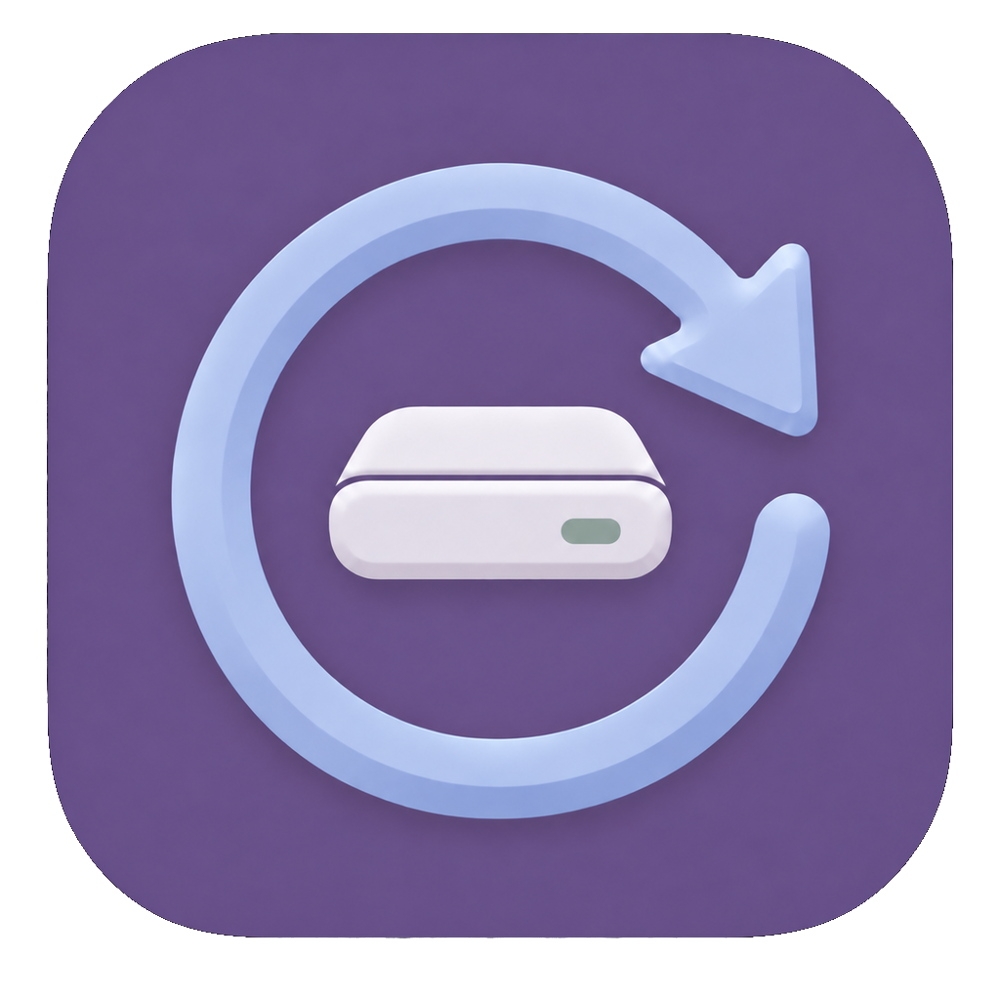
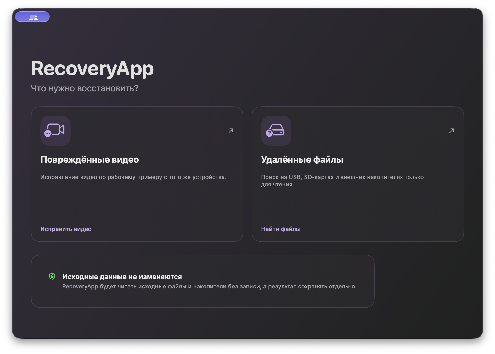
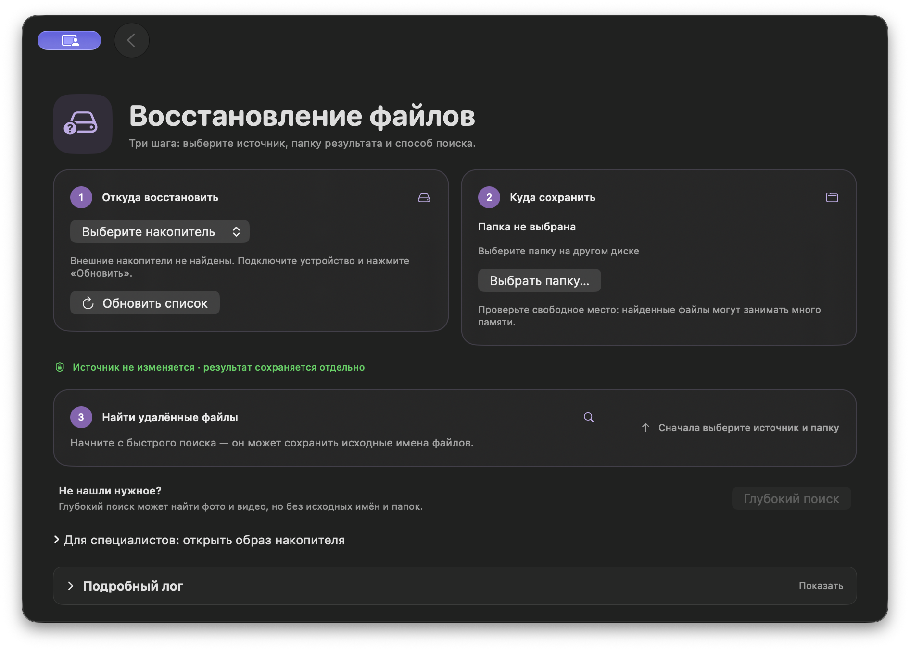
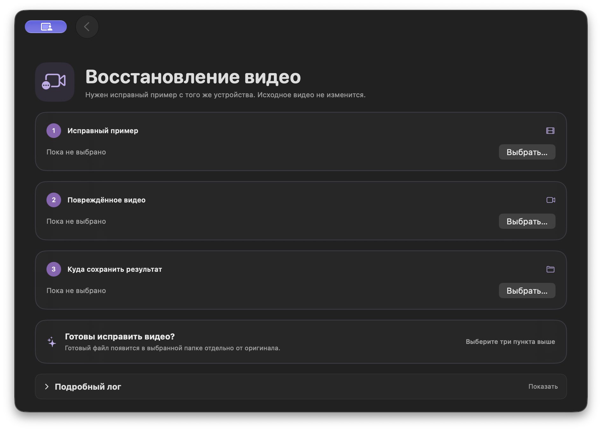

# RecoveryApp

### Вернуть удалённые файлы. Дать повреждённому видео второй шанс.

Бесплатное приложение для Mac с понятным русским интерфейсом.

**macOS 14+ · Apple Silicon · Открытый исходный код**

[**Скачать для Mac**](https://github.com/KrakeKrip/RecoveryApp/releases/tag/v0.8.1-lab.1) · [Первый запуск](#установка) · [Руководство](docs/USER_GUIDE.md) · [Сообщить о проблеме](https://github.com/KrakeKrip/RecoveryApp/issues)

> **Сейчас доступна тестовая версия 0.8.1 (13).** Она проверялась на синтетических
> данных и в ограниченных тестах с реальными накопителями. Чистая установка на
> другом Mac ещё не проверена; восстановление любых данных не гарантируется.

## Чем поможет RecoveryApp

| Что случилось | Что можно попробовать |
|---|---|
| Удалили файлы с флешки, SD-карты или внешнего диска | Быстрый поиск на FAT32/exFAT с попыткой сохранить имена. Выбирайте нужные находки и фильтруйте их по типу, имени и размеру. |
| Быстрый поиск не нашёл нужное | Глубокий поиск фото JPEG/PNG и видео MOV/MP4 по сигнатурам. Исходные имена и папки при этом не сохраняются. |
| Видео повреждено и не открывается | Исправление по рабочему видео-примеру с того же устройства и с близкими настройками записи. Метод подходит не для всех повреждений. |

Результаты сохраняются отдельно. После операции можно открыть папку или показать
готовый файл в Finder прямо из приложения.

Посмотреть экран восстановления удалённых файлов

Посмотреть экран исправления видео

## Установка

1. [Скачайте тестовый пакет](https://github.com/KrakeKrip/RecoveryApp/releases/tag/v0.8.1-lab.1).
   В разделе **Assets** выберите файл `.dmg` — не архив `Source code`.
2. Откройте DMG и перетащите **RecoveryApp** в **«Программы»**.
3. Попробуйте запустить приложение.
4. Если macOS заблокирует запуск, откройте **«Системные настройки →
   Конфиденциальность и безопасность»**, нажмите **«Всё равно открыть»**
   и подтвердите запуск.

Приложение пока без Developer ID и нотариализации Apple, поэтому macOS может
показывать предупреждение. **Не отключайте Gatekeeper.** Для готового приложения
не нужны Xcode, Swift или команды в Терминале. Intel Mac пока не поддерживается.

В релизе также есть ZIP приложения, соответствующие исходники и `SHA256SUMS.txt`
для проверки скачанных файлов.

## Как начать восстановление

**Удалённые файлы:** подключите накопитель → выберите его в приложении → укажите
папку **на другом физическом диске** → запустите быстрый поиск → выберите файлы
и сохраните результат. Если поиск не помог, попробуйте глубокий.

**Повреждённое видео:** выберите исправный пример, повреждённое видео и папку
результата на другом физическом диске → запустите исправление. Оригиналы не меняются.

Если данные важны, прекратите пользоваться исходным носителем: новые записи
могут затереть удалённые файлы. При физических неисправностях или незаменимых
данных безопаснее остановиться и обратиться к специалистам.

## Ваши данные остаются у вас

- RecoveryApp открывает источник **только для чтения**: не форматирует его и
  не записывает на него восстановленные файлы.
- Результат нужно сохранять **на другой физический диск**, не на другой раздел
  той же флешки. Перед операцией приложение повторно проверяет выбранный источник.
- Разрешение на чтение накопителя выдаёт macOS. Приложение не принимает
  и не хранит ваш системный пароль.
- **Сети и телеметрии сейчас нет.** Файлы не отправляются на сервер.
- Глубокий поиск можно остановить: уже найденные файлы остаются в папке сессии.

Сеть, телеметрия и автообновление запланированы на отдельный будущий этап
с явным согласием пользователя; в текущей версии они не реализованы.

## Чего ожидать от результата

Сохранённый файл не обязательно полностью исправен. Перезапись и фрагментация
могут сделать восстановление невозможным или неполным. Даже совпавший размер
не доказывает целостность — откройте результаты и проверьте их самостоятельно.

Глубокий поиск может занимать много времени. RecoveryApp показывает доступные
данные о ходе операции, но не обещает точное время окончания.

Подробнее: [руководство пользователя](docs/USER_GUIDE.md).

## Обратная связь

[Создайте Issue](https://github.com/KrakeKrip/RecoveryApp/issues) и укажите версию
macOS, версию приложения, выбранный режим и что произошло. Если прикладываете
лог или скриншот, удалите личные пути и имена файлов. **Не публикуйте пароли,
личные фото, видео или образы своих накопителей.**

## Для разработчиков и агентов

Нативный интерфейс — SwiftUI, общее ядро — **RecoveryCore на Swift**.
GUI и CLI используют одну реализацию восстановления. Есть CLI с JSON/JSONL
для тестов и автоматизации.

- [Карта документации](docs/README.md) и [руководство агента](docs/AGENT_GUIDE.md).
- [Сборка и разработка](docs/DEVELOPMENT.md), [команды CLI](docs/CLI.md).
- [Продукт](PRODUCT.md), [архитектура](ARCHITECTURE.md), [задачи](TASKS.md),
  [решения](DECISIONS.md) и [правила работы](AGENTS.md).
- [Состояние и границы проверок](STATUS.md), [отчёты](reports/).

## Лицензии

RecoveryApp — бесплатный некоммерческий проект. Код приложения распространяется
по [GPL v2](LICENSE). Встроенные PhotoRec, libjpeg-turbo, Sleuth Kit,
untrunc и FFmpeg сохраняют собственные лицензии и уведомления; инструменты
восстановления запускаются отдельными процессами.

В комплект включены уведомления, исходные архивы и патчи; исходники приложения
прикладываются к тому же релизу. [Условия и комплектность поставки](docs/DISTRIBUTION_CHECKLIST.md),
[происхождение сборок](docs/TOOLCHAIN_PROVENANCE.md),
[уведомления сторонних компонентов](Packaging/THIRD-PARTY-NOTICES.txt).
